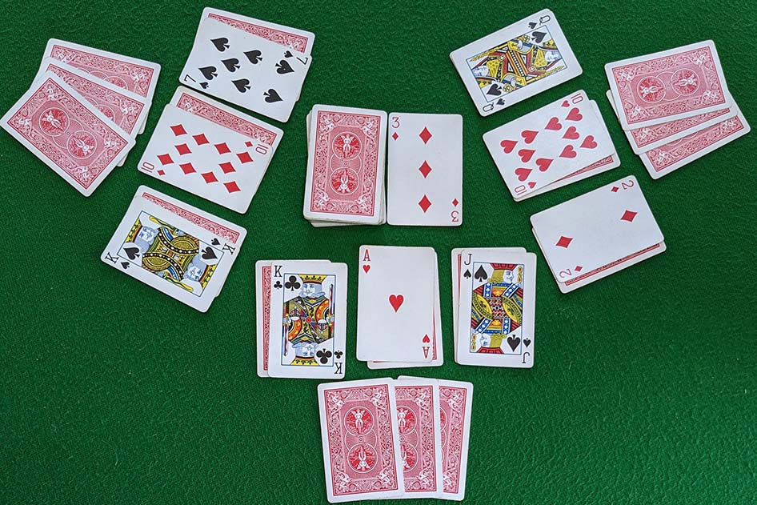

# Shit Head

## What is it?

 - Shit Head is a card game where players try to get rid of all of their cards.
 - The game is played with a standard deck of 52 cards and two Jokers
 - The game is played with 2-4 players. 

## Deal
- The dealer is randomly selected for the first hand. The deal rotates clockwise after each hand.

- The dealer deals a row of three face-down cards to each player, one at a time.
- The dealer deals three cards face-up to each player, one at a time, covering the face-down cards.
- The dealer deals a three card hand face-down to each player, one at a time.
- Any cards remaining undealt are placed face down to form a draw pile. The players pick up their three card hands and look at them.

- Before play each player may exchange any number of cards from the hand with her face-up cards. A player may never look at the face-down cards until they are played. (Players usually take lower ranking face-up cards into their hands.)

## Card Abilities

 - 2 : Resets the deck back to number 2 and can be played on anything

 - 7 : The next player needs to play lower than or equal to 7
 - The 7 must be played in order and can be played on anything

 - 8 : The card is invisible and the next player needs to play what's underneath the 8
 - If there's nothing underneath the 8 then the next player needs to play a card equal or higher than 3

 - 10 : The player burns the pile and gets to go again
 - A player cannot win on a 10 as if they burn the pile they need to place a card down after

## Card Values
3 < 4 < 5 < 6 < 7 < 9  < J < Q < K < A < Joker

## Gameplay

- The game is played clockwise
- The player can play as many of the same cards i.e 2s, 3s, 4s, etc
  - They have to be the same value
- If on the discard pile there is four of the same kinds that is a burn and the player gets to go again
- If theres 3 of the same cards on the discard pile and the next player to put the same value card they get the burn and get to play another card

## Burn

- A burn is when a player plays 4 of the same kind of card it gets rid of the pile and the player gets to go again
- If a player plays a 10 they burn the pile and get to go again

## The Endgame

- If you begin your turn with no cards in your hand (because you played them all last time and the draw pile was empty), you may now play from your face-up cards.
- When you are playing your face down card you need to normal rules and if you cannot play you need to pick up the pile and play from your hand.

- When you have played all your face-up table cards, and have no cards in your hand, you play your face-down cards blindly, flipping one card onto the pile when your turn comes.
- If the flipped card is playable, it is played, and it is the next player's turn to equal or beat it.
- If your flipped card is not playable (because it is lower than the previous play), you take the whole pile into your hand including the flipped card.
- It is then the next player's turn to start a new discard pile.
- Having picked up the pile, you will have to play from your hand on subsequent turns until you have once more got rid of all your hand cards and can flip your next table card.

- When you completely get rid of all of your hand and table cards, you have successfully avoided being the loser and can drop out of the game.
- When you flip your last table card, you can only drop out at that point if it beats the previous play (or if you are flipping it to an empty discard pile).
- If you flip your last card and it is not playable, you must pick it up along with the pile.
- As people drop out of the game, the remaining players continue playing.
- The last player left holding cards is the loser (also known as the shithead).
- This player must deal the next hand and is the current shithead.

## Vision
The vision is to create a mobile and desktop-friendly version of the famous game "Shithead".
The game should be easily accessible on PCs and mobile phones, and will be played online up to 2-4 players.